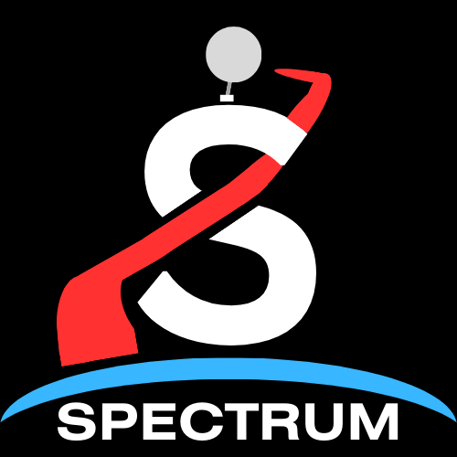
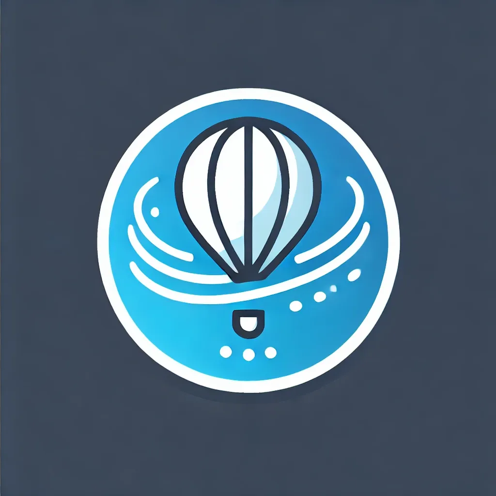
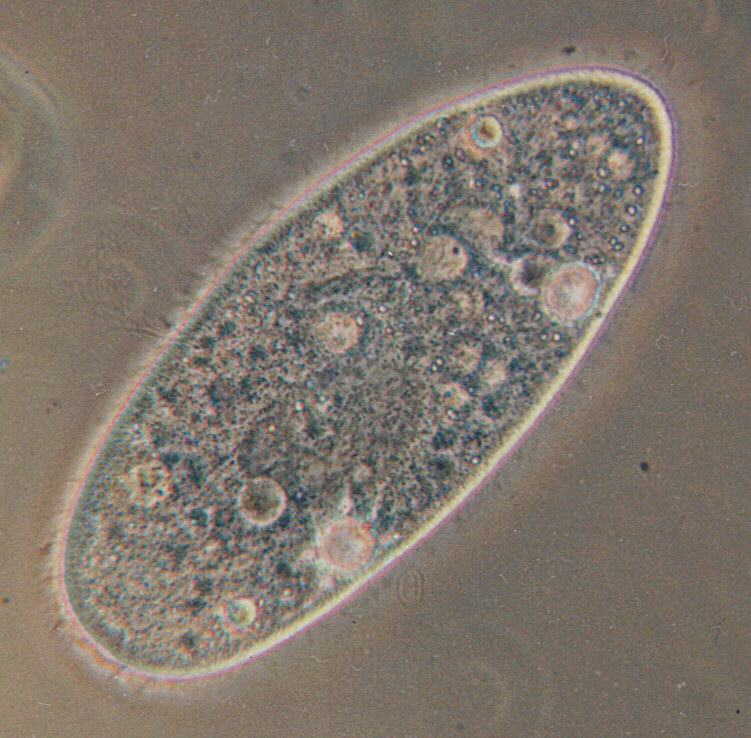

  
  

# Project Spectrum

**Exploring the survival of microorganisms in the stratosphere**

Team Spectrum is a student-led scientific initiative focused on studying the resilience of microorganisms in extreme environments. By sending biological samples into the stratosphere, we aim to investigate their survival under high-altitude conditions. Our mission integrates biology, engineering, and atmospheric science in a hands-on research context.

---

## Objectives

- Secure research funding and grants (finished)
- Develop and construct a viable stratospheric payload (finished) 
- Execute a high-altitude launch from Boston  (finished)
- Analyze survival rates of biological test subjects post-flight (ongoing)

---

## Main-Project Focus

We are currently studying the survival of *Paramecium*, a unicellular freshwater organism, in simulated stratospheric conditions. This includes environmental stress testing, data collection, and post-exposure analysis. We didnt get to launch it with our payload, because the airline lost and brought our luggage late. 

  

---
## Side-Project Focus

A mechanism that aims to drop pieces of paper (including stickers!). It is powered by a servo motor that is alligned on a gear rail. In Testing, it worked fine. 

  

---

## Progress Overview

Our team has made substantial progress in several core areas:

- Conducted literature reviews and initial scientific research  
- Produced payload sketches and early-stage prototypes  
- Developed foundational code and testing tools  
- Participated in technical planning and concept discussions  

---

## Documentation

Documentation and related files are currently being updated and reorganized. They will be made publicly available once finalized.

---

## Team

The project is led by a dedicated team of students with backgrounds in science, engineering, and technology:

- **[Alex](https://hackclub.slack.com/team/U0877PG14F4)** — `@alexmen656`  
- **[Alexander](https://hackclub.slack.com/team/U08HE8KST8T)** — `SaskoLOL`  
- **[Oliver](https://hackclub.slack.com/team/U07L48Q6BUY)** — `Slivki-coder`  
- **[Richard](https://hackclub.slack.com/team/U08HH8E5DQB)** — `@RichardD242`  

Additional information is available on our website: [https://alex.polan.sk/team-spectrum/](https://alex.polan.sk/team-spectrum/)

---

Temperature Sensors: 

  

---

Here is how the final box looks like: 

  

---

## Contact

If you're interested in supporting or collaborating with us, feel free to reach out through our website or Slack profiles linked above.
